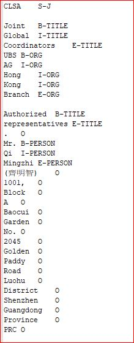
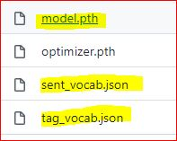

# Introduction of Repository

The repository is a reproduction and fork of https://github.com/Gxzzz/BiLSTM-CRF , while the data input and data type are different from original purpose.

This is a Pytorch implementation of BiLSTM-CRF for Named Entity Recognition, which is described in Bidirectional LSTM-CRF Models for Sequence Tagging.

The corpus is targeting English version of IPO prospectus of HKEX ,thus, no Chinese NLP tool is used in this repository

# Main dependencies
- Pytorch 1.8 (https://pytorch.org/get-started/previous-versions/)
- installation : pip install torch==1.8.0+cpu torchvision==0.9.0+cpu torchaudio==0.8.0 -f https://download.pytorch.org/whl/torch_stable.html (cpu version)
- The model was trainied on google colab, where pytorch has been pre-installed in the platform.

# Usage of this repository
- https://github.com/etnetapp-dev/ipo_pdfparsing_server
- api_server.py

# key components of repository
- raw textual data and labeled data (data folder) 
- corpus creation and textual data conversion to IOBES format (preprocessing folder)
- model training (train jupyter notebook)
- model testing (model_test.py)

# Corpus creation
- 1. extract all texts and paragraphs from  "parties involved" and "underwriting" in English version of IPO prospectus of HKEX and output result to txt files
- 2. load the txt data int excel and label records by columns or you can also label the data by using tools e.g. https://github.com/Wadaboa/ner-annotator
- 3. load labelled data into txt file and convert the textual data into iob format ('B'=Begin, 'I'=inter, O='omit') by the script, "text2iob1.py" in the preprocessing folder
- 4. convert the data from iob format into IOBES format (('B'=Begin, 'I'=inter,'E'=End, 'S'=Single , O='omit')
- If using other Labelling tools e.g. https://github.com/Wadaboa/ner-annotator, please specify to apply IOBES format when extracting output.

### Manual data labelling (in excel file)

### Corpus format : Characters and tags are seperated by \t

# model training
- Detail training descriptions and documentation are all specified inside the train.ipynb. The train.ipynb is executed via google colab pro platform on which,  all major dependenies,  e.g. pytorch and sklearn, are pre-installed , thus, no open-library installation is required on google colab platform.
- The overall training process varies from 2 hours to 4 hours, subject to the volumn of data and the type of GPU instances (Google colab randomly assigns Nvidia K80 or more advanced version to the notebook)
- Please edit the data and model folder path according to the google drive file structures.

# model testing and deployment
- There are 3 key files to be stored locally for re-usage and testing of the NER model after training , including, model.pth, sent_vocab.json and tag_vocab.json.
- The pytorch 1.8 cpu version must be installed in local machine to run the model.

### Key model component for deployment and testing

-
